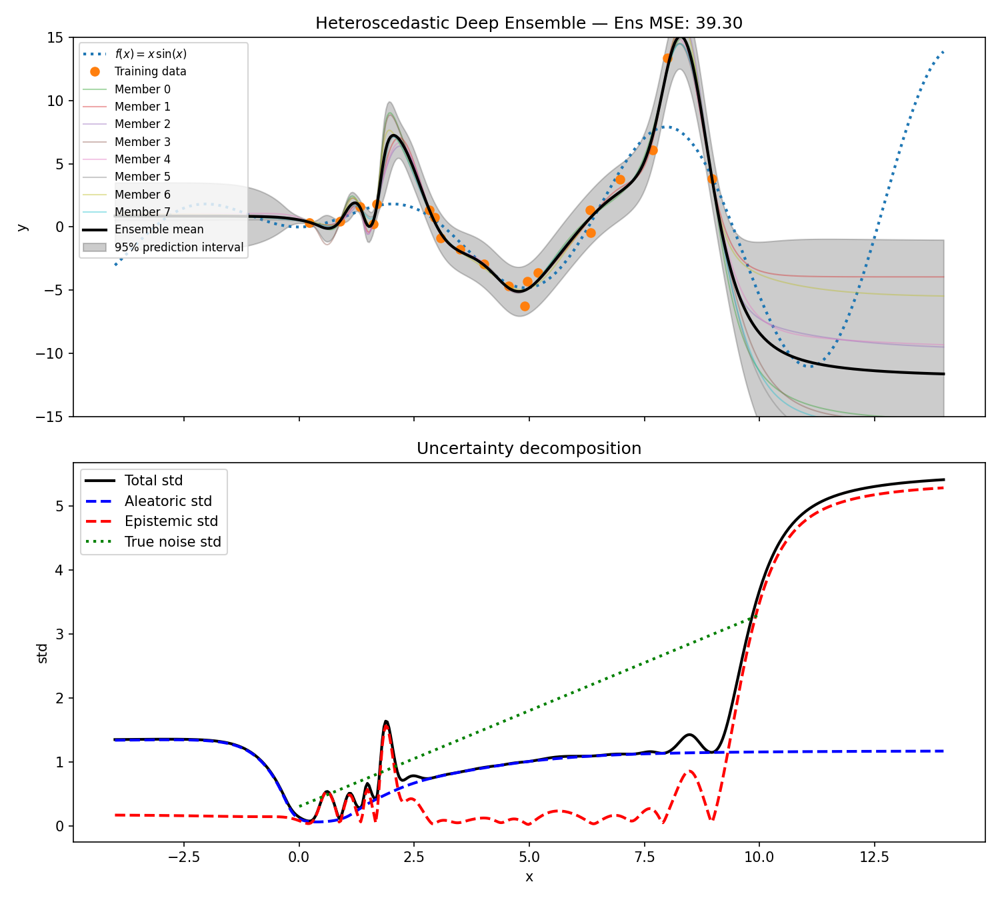

# Example 00: Heteroscedastic Regression

8 MLPs, each on its own GPU via `torchrun`. Each predicts mean + log-variance on a 1D regression problem with input-dependent noise (x·sin(x), adapted from [Skafte et al. 2019](https://arxiv.org/abs/1906.03260)). Predictions are gathered with `all_gather` and decomposed into aleatoric (learned noise) and epistemic (member disagreement) uncertainty.

The ensemble mean fits the true function better than any single member. Epistemic uncertainty is high where data is sparse, as you'd expect.

## Output



## Run

```bash
torchrun --nproc_per_node=8 examples/00_heteroscedastic_regression/main.py
```

## References

> B. Lakshminarayanan, A. Pritzel, and C. Blundell, "Simple and Scalable Predictive Uncertainty Estimation using Deep Ensembles," NeurIPS, 2017. https://arxiv.org/abs/1612.01474

> N. Skafte, M. Jørgensen, and S. Hauberg, "Reliable training and estimation of variance networks," NeurIPS, 2019. https://arxiv.org/abs/1906.03260
