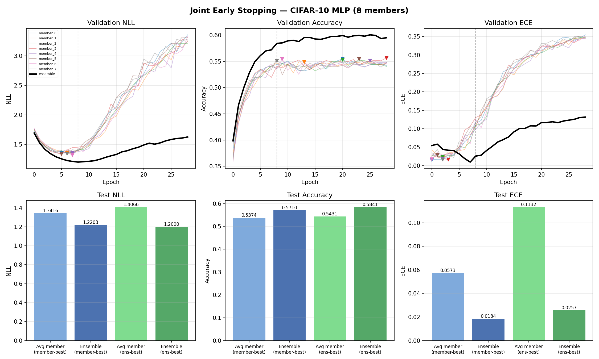

# Example 01: Joint Early Stopping

A deep ensemble on CIFAR-10 using Lightning. Each GPU trains its own wide MLP. Individual members overfit: their validation NLL rises after early epochs. The ensemble's NLL stays more stable for longer, which means the best time to stop depends on whether you're optimizing per-member or ensemble performance.

Stopping at the ensemble-NLL optimum gives better test accuracy and calibration than stopping at each member's individual optimum.

## Output



Top row: validation NLL / Accuracy / ECE curves for each member (coloured) and the ensemble (black). Bottom row: bar charts comparing member-best vs ensemble-best checkpoints on the test set.

## Run

```bash
uv run python examples/01_joint_early_stopping/main.py
```

Requires at least 1 GPU (uses all available). Training takes ~200 epochs on CIFAR-10.

## References

> L. Fredsgaard and M. N. Schmidt, "On Joint Regularization and Calibration in Deep Ensembles," TMLR, 2025. https://openreview.net/forum?id=6xqV7DP3Ep

> B. Lakshminarayanan, A. Pritzel, and C. Blundell, "Simple and Scalable Predictive Uncertainty Estimation using Deep Ensembles," NeurIPS, 2017. https://arxiv.org/abs/1612.01474

> A. Krizhevsky, "Learning Multiple Layers of Features from Tiny Images," 2009. https://www.cs.toronto.edu/~kriz/cifar.html
