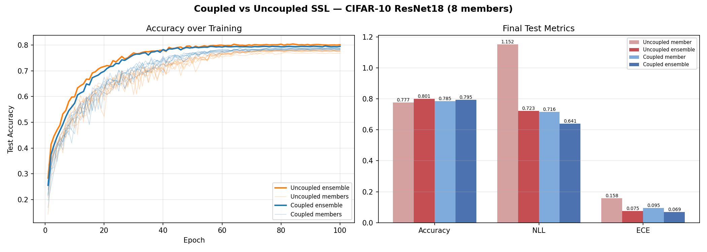

# Example 02: Coupled Semi-Supervised Learning

Ensemble-consensus SSL on CIFAR-10, vanilla PyTorch. Each member trains on a small labeled subset (5k samples) with standard cross-entropy, plus a KL divergence term on unlabeled data that pushes its predictions toward the ensemble average. The ensemble average is computed via `all_gather` with no gradient flow across workers.

The consensus term on unlabeled data acts as a regularizer. It improves both individual member accuracy and ensemble accuracy beyond what supervised training alone achieves.

## Output



Left panel: per-member and ensemble accuracy over training epochs. Right panel: bar chart of final test Accuracy / NLL / ECE for avg member vs ensemble.

## Run

```bash
torchrun --nproc_per_node=8 examples/02_coupled_ssl/main.py
```

With M=1 the KL term is zero (self-consensus = supervised baseline). With M>1 the consensus loss takes effect.

## References

> R. H. Tirsgaard, L. Fredsgaard, M. Wodrich, M. Jordahn, and M. N. Schmidt, "Semi-Supervised Learning for Molecular Graphs via Ensemble Consensus," 2025. https://openreview.net/forum?id=hk6iX4mg3B

> A. Krizhevsky, "Learning Multiple Layers of Features from Tiny Images," 2009. https://www.cs.toronto.edu/~kriz/cifar.html
