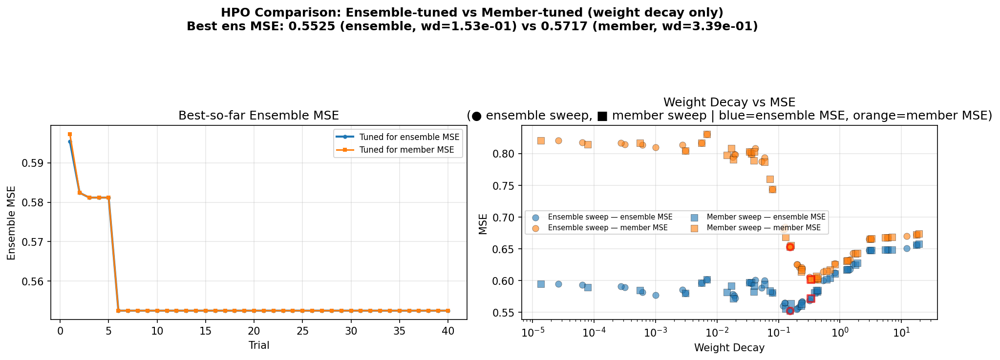
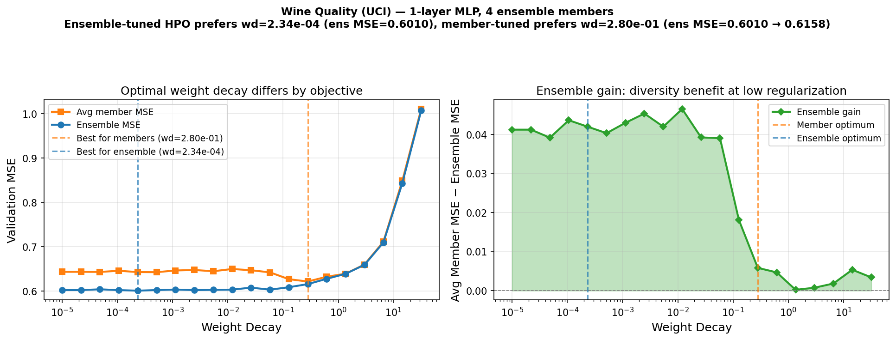
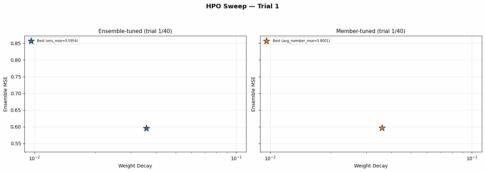

# Example 03: Ensemble-Aware HPO

HPO on UCI wine-quality regression using Hydra + Optuna. Compares two objectives: tuning weight decay to minimize **ensemble** MSE vs tuning to minimize **member** MSE.

The two objectives end up preferring different weight decay values. The ensemble objective favors lower regularization, where members land in different local optima and their errors are less correlated. Averaging then helps. The member objective favors higher regularization, where each member is individually better but the ensemble doesn't gain much from averaging.

## Outputs



Left: best-so-far ensemble MSE per trial for each sweep. Right: weight decay vs MSE scatter (circles = ensemble sweep, squares = member sweep).



The swept range of weight decays on the full dataset. The ensemble optimum (low regularization) is separated from the member optimum.



Animated trial-by-trial view of both sweeps.

## Run

```bash
# Single smoke-test run (no sweep):
uv run python examples/03_hpo_ensemble/train.py

# Full HPO sweep, ensemble objective:
uv run python examples/03_hpo_ensemble/train.py --multirun objective=ensemble

# Full HPO sweep, member objective:
uv run python examples/03_hpo_ensemble/train.py --multirun objective=member

# Regenerate plots from existing results:
uv run python examples/03_hpo_ensemble/plot.py
```

Results are appended to `outputs/results_wine_all_{objective}_3seeds.jsonl` after each trial.

## References

> L. Fredsgaard and M. N. Schmidt, "On Joint Regularization and Calibration in Deep Ensembles," TMLR, 2025. https://openreview.net/forum?id=6xqV7DP3Ep

> B. Lakshminarayanan, A. Pritzel, and C. Blundell, "Simple and Scalable Predictive Uncertainty Estimation using Deep Ensembles," NeurIPS, 2017. https://arxiv.org/abs/1612.01474

> P. Cortez, A. Cerdeira, F. Almeida, T. Matos, and J. Reis, "Modeling wine preferences by data mining from physicochemical properties," Decision Support Systems, 2009. https://archive.ics.uci.edu/dataset/186/wine+quality
