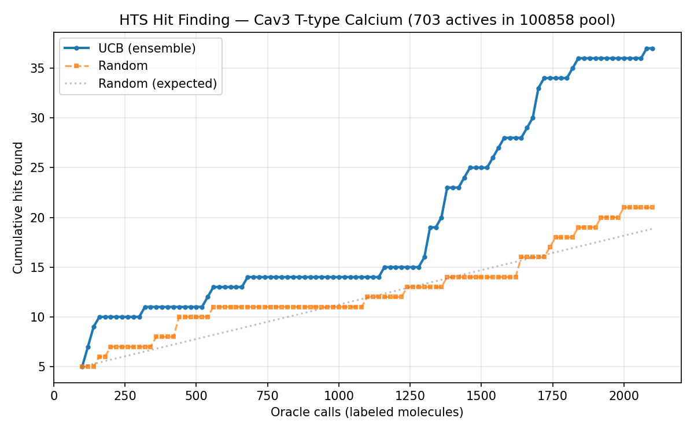
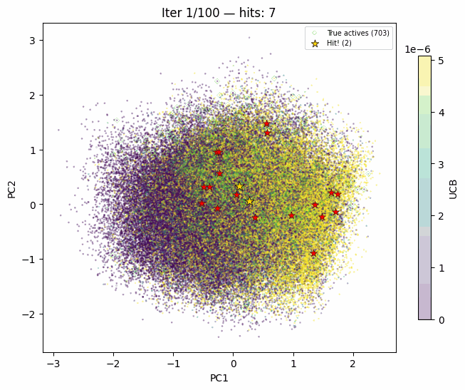
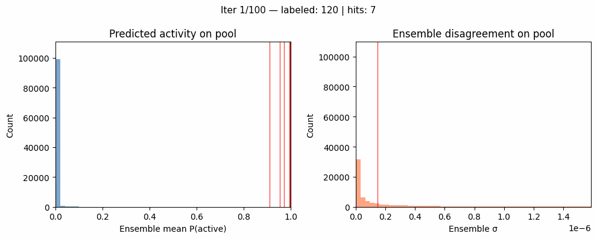
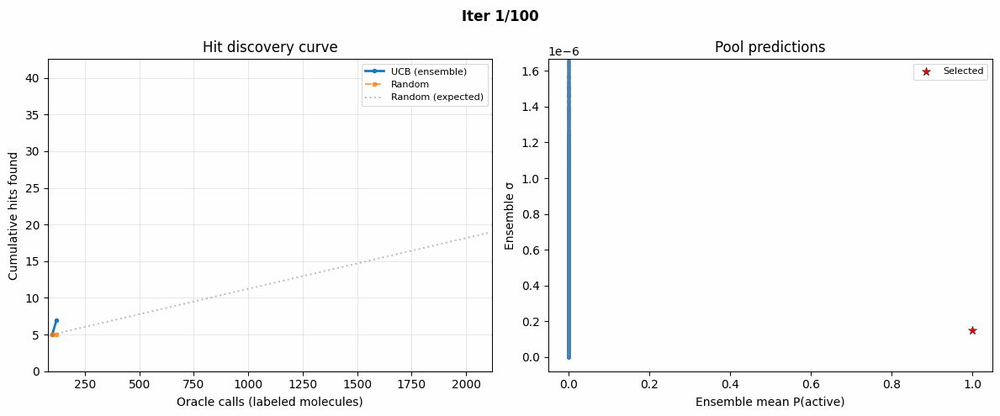

# Example 04: HTS Hit Finding with Ensemble UCB

Active learning for high-throughput screening on the Cav3 T-type Calcium Channel HTS assay (Butkiewicz et al., 2013). Only 0.7% of ~101k molecules are active, so random screening wastes most oracle calls.

Each `torchrun` worker trains an independent binary classifier on 1024-bit Morgan fingerprints. Predictions are gathered via `all_gather` to compute ensemble mean P(active) and disagreement σ. UCB acquisition (μ + κ·σ) uses both the predicted activity and the ensemble disagreement to pick which molecules to label next, finding hits faster than random.

## Outputs



Cumulative hits found vs oracle calls (labeled molecules). UCB outpaces random and the expected random baseline.



2D PCA projection of the molecular fingerprint space, colored by UCB score. Gold stars = hits found; red stars = selected non-hits.



Evolution of the pool's predicted activity and disagreement distributions over AL iterations.



Combined view: discovery curve (left) and pool scatter plot colored by uncertainty (right).

## Run

```bash
torchrun --nproc_per_node=8 examples/04_hts_hit_finding/main.py
```

The dataset is downloaded automatically on first run (~101k compounds from Harvard Dataverse). Morgan fingerprints are cached to `data/cav3_morgan1024.pt`.

## References

> M. Butkiewicz et al., "Benchmarking Ligand-Based Virtual High-Throughput Screening with the PubChem Bioassay Data," Molecules, 2013. https://doi.org/10.3390/molecules18010735

> B. Lakshminarayanan, A. Pritzel, and C. Blundell, "Simple and Scalable Predictive Uncertainty Estimation using Deep Ensembles," NeurIPS, 2017. https://arxiv.org/abs/1612.01474
